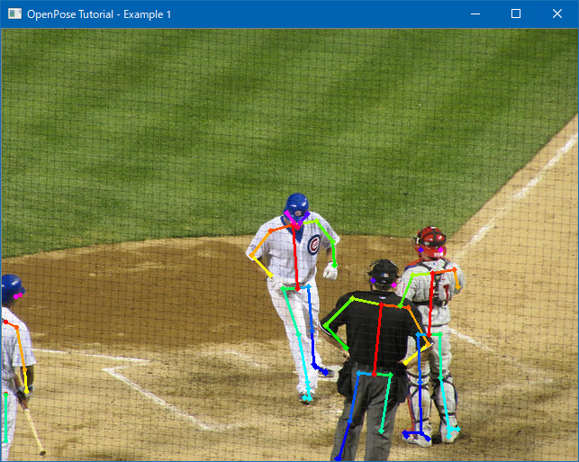

# Pose 1 Extract From Image

## Quick Start

#### 1. Build OpenPose

````dos
> cd <OpenPoseDotNet_dir>
> BuildWindowsVS2015.bat <Debug/Release>
````

#### 2. Build OpenPoseDotNet.Native

````dos
> cd <OpenPoseDotNet_dir>\src\OpenPoseDotNet.Native
> BuildWindowsVS2015.bat <Debug/Release>
````

#### 3. Try Tutorial

````dos
> cd <OpenPoseDotNet_dir>\examples\TutorialDeveloper\Pose1_ExtractFromImage
> CopyOpenPose.bat <Debug/Release>
> dotnet run -c Release
````

